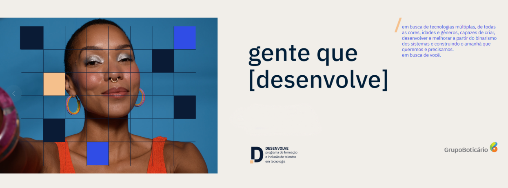

<h1 align="center">Programa Desenvolve 2023</h1>

  O <a href="https://desenvolve.grupoboticario.com.br/">Programa Desenvolve</a>,
  do Grupo Boticário, oferece uma formação gratuita e inclusão de talentos em tecnologia por meio de trilhas de diversas áreas. Eu estou na trilha Fullstack e esse é um guia por toda minha evolução, projetos e anotações que fiz/farei ao longo desses 6 meses do programa. ✨

<!-- 

 <a href="#woman_technologist-anotações">Anotações</a> • 
 <a href="#rocket-projetos-desenvolvidos">Projetos desenvolvidos</a>

 -->

## :woman_technologist: Anotações

Categoria | Anotações |
| ----------- | ----------- |
| JavaScript | [Módulos e strict mode](https://github.com/ananuness/desenvolve2023/tree/main/notas-de-aula/javascript/modulos-e-strict-mode) |
| JavaScript | [Objetos e prototype](https://github.com/ananuness/desenvolve2023/tree/main/notas-de-aula/javascript/objetos-e-prototype) |
| JavaScript | [Programação orientada à objetos e JavaScript](https://github.com/ananuness/desenvolve2023/tree/main/notas-de-aula/javascript/poo-e-javascript) |
| JavaScript | [Node.js](https://github.com/ananuness/desenvolve2023/tree/main/notas-de-aula/javascript/node) |
| JavaScript | [Node.js e Assincronicidade](https://github.com/ananuness/desenvolve2023/tree/main/notas-de-aula/javascript/node-e-assincronicidade) |
| JavaScript | [React](https://github.com/ananuness/desenvolve2023/tree/main/notas-de-aula/javascript/react) |
| HTTP | [HTTP: Entendendo a web por debaixo dos panos](https://github.com/ananuness/desenvolve2023/tree/main/notas-de-aula/http) |
| Programação | [API (Application Programming Interface)](https://github.com/ananuness/desenvolve2023/tree/main/notas-de-aula/api/introducao) |
| NoSQL  | [MongoDB: uma alternativa aos bancos relacionais tradicionais](https://github.com/ananuness/desenvolve2023/tree/main/notas-de-aula/nosql/introducao-ao-mongodb) |
| SQL  | [Consultas SQL: avançando no SQL com MySQL](https://github.com/ananuness/desenvolve2023/tree/main/notas-de-aula/sql/avancando-sql-com-mysql) |
| UI Design | [Figma: construindo o layout do site mobile](https://github.com/ananuness/desenvolve2023/tree/main/notas-de-aula/ui-ux-design/1-construindo-layout-mobile) |
| UI Design | [Figma: conhecendo componentes da interface](https://github.com/ananuness/desenvolve2023/tree/main/notas-de-aula/ui-ux-design/2-conhecendo-componentes) |
| UI Design | [Figma: projete sites para diversas telas](https://github.com/ananuness/desenvolve2023/tree/main/notas-de-aula/ui-ux-design/3-projete-para-diversas-telas) |
| UI Design  | [Figma: trabalhando na construção de um Design System](https://github.com/ananuness/desenvolve2023/tree/main/notas-de-aula/ui-ux-design/4-construindo-design-system) |

## :rocket: Projetos desenvolvidos

| Categoria | Projeto | Tecnologias |
| ----------- | ----------- | ----------- |
| UI Design | [Design Diário](https://www.figma.com/file/zg2upbaEV1TRGgJDryU65e/Design-Di%C3%A1rio?node-id=153%3A4118&t=La2c5fsB6zZbHcf0-1) | Figma |
| Frontend | [Barbearia Alura](https://github.com/ananuness/barbearia-alura) | HTML, CSS, JS |
| Frontend | [Step Form](https://github.com/ananuness/step-form) | HTML, CSS, JS |
| Backend | [Library API](https://github.com/ananuness/library-api) | Node.js (Express), MongoDB |
| Frontend | [React TDD](https://github.com/ananuness/react-tdd) | TypeScript, React |

<h4 align="center">🚧 Readme em construção 👷🏻‍♀️</h4>

  Feito com 🧡 por
  <a align="center" href="https://www.linkedin.com/in/ana-beatriz-nunes/">
    Ana Beatriz Nunes
  </a>

