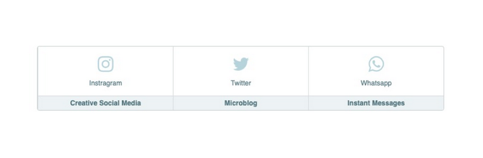

  

# Desafio Flexbox

Essa atividade consiste em desenvolver a estilização de um html que já existe. 
As vezes focamos muito em atividades que criam o HTML do zero e montamos eles da forma que queremos, mas no dia-a-dia não é bem assim que funciona. Você precisa se adaptar aos novos padrões do time, formas diferentes de escrever o código e nomear classes etc.

Então a partir do html que vou enviar para vocês, vocês salvarão ele em um arquivo junto a um style.css e devem fazer com que o layout fique igual ao da imagem!

**Bônus:** quem quiser criar uma versão mobile e ainda colocar efeitos de hover (quando passa o mouse em cima) iremos adorar ❤️

## Layout Requerido
---

  

### Layout desenvolvido
---

  

Hover: 

